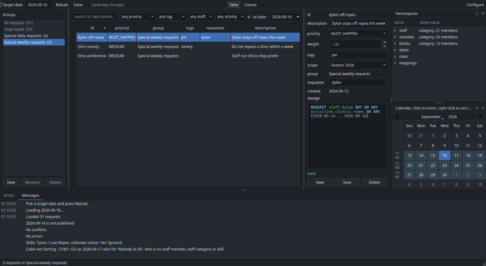
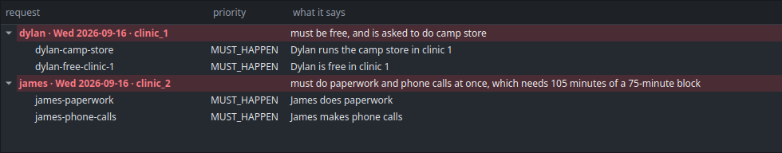
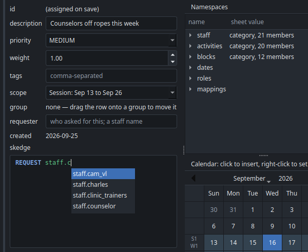

# The request manager

```
puppet-strings app
```



**Toolbar.** Pick the target date (tomorrow by default). Nothing is read when the window
opens; **Reload** reads every sheet for the date shown, and again whenever it is pressed.
The Calendar is read first and the date checked against it, so a date camp is not running
says so at once — naming the range the calendar covers and the nearest camp day — rather
than after a slow read of everything else. It is a prompt to pick another date, not a
failure: the window stays as it was, and the calendar panel shades the days you can choose.
Reading the sheets and loading the offerings both put up a progress panel, the one the
solver uses, without a Cancel button: neither can usefully be stopped part-way, but both
take long enough over Google Sheets to be worth saying so. Both run off the window's own
thread, so the panel keeps painting and the window stays alive while they work.
**Load offerings** turns the Offerings tab into one `CLINIC` request per offered clinic,
tagged `generated`, and saves them to the session's `Clinics` tab. Such a request names every
position on Clinic_Data, so a clinic wanting a facilitator, a second and a lifeguard
reads:

```skedge
REQUEST ANY_1_OF staff.all DO activities.clinics.canoe_1_2 AS_ROLE EACH_OF {roles.first + roles.second + roles.lifeguard} DURING blocks.clinic_1 ON 2026-09-17
```

`EACH_OF` is what makes each position its own choice of person; `ALL_OF` would ask one
person to hold all three. A clinic with one position names it on its own, `AS_ROLE
roles.first`, because a one-item set takes no quantifier. The clinic runs fully
staffed or not at all — filling one position of an instance fills them all — and every
position it wants is written down rather than left to the skill matching.

**Load offerings** also makes the day's spreadsheet when it is not there yet, with its
Offerings grid copied from the Clinic Schedule template and its other tabs empty. So a day
nobody has set up is one click from being ready, and the click after that reads what you
put in the grid.

Loading first removes every generated request for the target date, so the sheet mirrors
that day's Offerings tab: a clinic you removed there disappears here. Hand-written requests are
never touched. Between loads you can delete a generated request to drop that clinic, or
edit it, for example to replace `ANY_1_OF staff.all` with a category to limit who runs it;
loading again undoes such edits. **Solve** builds the schedule and opens it in a window with the staff view, the
clinic view and the report; it asks first if no offerings are loaded for the date.
**Publish** in that window writes the day's own spreadsheet in the
[schedules tree](sheets.md#the-schedules-tree), asking first if the date is already
published.

**Cabin acts** need no button. They are activities, read from every sheet in the Cabin
Acts folder each time **Reload** runs, and one line on the Requests sheet asks for all of
them:

```skedge
REQUEST EACH_OF activities.cabin_acts.all DURING blocks.cabin_act
```

Each act's HEROES cell becomes its positions, so who may fill them is already written
down. A hero nothing on the sheets answers to is reported with the other load warnings,
naming the cabin and the day. See
[The sheets](sheets.md#cabin-act-sheets-the-cabin-acts-folder) for the grid they come from.

**Configure**, on the right-hand end of the toolbar, is where the Google account and the
sheets are chosen. See [Install and set up](install.md#5-sign-in-and-choose-the-sheets).
It also has **Open trainer**, which starts [the trainer](training.md) in a window of its
own.

**Same-day changes.** Once the day on screen is published, the toolbar offers
**Same-day changes** and **Who is off today…**. See [Same-day changes](same-day.md).

## Groups

**The groups pane.** Down the left-hand side is every group of requests, with how many
requests are in each. Click one and the table shows only that group. `All requests` and
`Ungrouped` head the list and are not groups themselves: `Ungrouped` is whatever is in no
group at all, which is how a request that has been forgotten about turns up.

Two groups are always there — **Special daily requests** and **Special weekly
requests** — and you make the rest. Requests made from the Offerings tab are on no shelf,
so they sit under `Ungrouped`: there are dozens of them and the `generated` tag and the
`CLINIC` priority already tell them apart. **New** asks for a name, **Rename**
renames a group everywhere it is used, and **Delete** takes a group off its requests
without deleting the requests themselves. The two default groups cannot be renamed or
deleted.

**A request sits on one shelf**, the way a piece of paper is in one folder, or on none.
Groups and tags are separate, so a request in the `Ropes rewrite` group can still be
tagged `legal`, and a request that is about several things is a job for tags.

There are two ways a request gets its group, and no others:

- **A new request joins the group being shown.** Pick the group first, then **New**.
- **Drag its row onto a group's label to move it.** Select one row or several, drag them
  across to the pane, and let go over the group they should be on. What travels with the
  pointer is a small card naming the first request, with a count on its corner when there
  are more, and the group a drop would land on is outlined as the pointer passes over it.
  Dropping them on
  `Ungrouped` takes them off every shelf. The status line says how many moved. `All
  requests` is not a shelf, so the pointer shows a refusal over it; hold the drag at the
  top or the bottom of the list and it scrolls, so a group below the fold can be dropped
  on like any other.

**Right-click a group** to choose the [Requests tab](sheets.md#requests-its-own-spreadsheet)
its *new* requests are written to — a group of standing agreements can send its requests
to `Season Requests` without your having to remember each time. Requests already written
stay where they are: a request's tab is when it applies, and changing a group's default is
not a reason to move them.

The group lives in the `group` column of the Requests sheet, so it is there again the next
time the app opens. A group you have just made and put nothing in yet stays in the pane
until you close the app.

**The table.** One row per request. Click a column heading to sort by it. Filters above
it: free text over id, description, Skedge and requester; priority; tag; staff; activity;
and a date. These narrow whatever group is showing, so the group is the shelf and the
filters are the search. To ask how far a request reaches, filter by the date itself.

**on date** starts on the date being scheduled and follows it, because that is the day you
are almost always asking about. Moving the filter to look at another day leaves the target
date alone, so you can check next Monday without changing what Solve would build.

The staff and activity filters use the names a request resolves to, so filtering by
`dylan` finds requests written for `staff.counselor` as well.

## Errors

**The errors pane.** Along the bottom, everything wrong with the requests that can be seen
without solving. Two kinds of thing sit in it: **conflicts**, where two requests cannot
both be kept, and **errors**, where one request on its own asks for something the sheets
rule out. Both name a slot and the requests to go and look at, and double-clicking a row
opens that request in the editor.

### Conflicts

Every place two requests contradict each other. Each heading is one collision — one person, one date, one block —
and everything under it belongs to that collision: the requests caught in it and the
reasons they cannot all hold. A request in two collisions appears under both.
Double-click one to open it in the editor.

**A conflict means the day cannot be built at all**, so only `MUST_HAPPEN` requests make
one. Two requests of any lower priority wanting different things of the same person in the
same block is not a conflict: the solver keeps the one worth more and says in the report
that it could not meet the other, and the day still comes out. There have to be at least
two requests that *must* happen, about one person, in one block, on one date, asking for
things that cannot both be true.

| What it catches | Example |
|---|---|
| Asked to work and to be free | `REQUEST staff.dylan DO activities.clinics.riflery DURING blocks.clinic_1` beside `REQUEST staff.dylan FREE DURING blocks.clinic_1` |
| Asked to do something and told not to | the same, beside `REQUEST staff.dylan NOT DO activities.clinics.weapons` |
| Asked to be free and to be busy | `FREE` beside `NOT FREE` in one block |
| Two things at once that do not fit | two `FOR` tasks whose minutes exceed the block, or two clinics in one block |



Sharing a slot is not by itself a collision: two requests asking for the same clinic agree,
and two half-hour tasks fit in one block quite happily. What they say has to be impossible.

It also reads only what is **settled**. `REQUEST ANY_1_OF staff.all DO …`, `DURING ANY_2_OF
blocks.all` and every `PREFER` leave the solver room to move, and moving things around each
other is its job, so they are never reported. What is left is worth looking at: a request
saved into a collision says so in the toolbar as it saves. One request may hold several
statements, so it can also contradict itself, and that shows up the same way.

### Errors

One request, on its own, asking for something that cannot happen. Every name in it exists —
the validator has already said so — and it is still wrong:

| What it catches | Example |
|---|---|
| Somebody who is not checked off | `REQUEST staff.henry DO activities.clinics.aerial_silks DURING blocks.clinic_3` when Henry has no aerial silks checkoff, or not the RAL the position needs, or is not one of the people a cabin act's card asks for |
| A position the activity does not have | `AS_ROLE roles.third` on a clinic with two positions |
| A clinic the day does not run then | `DURING blocks.clinic_3` when the day's Offerings tab runs it in clinic 1, or does not run it at all |
| Work asked of somebody who is away | a request naming somebody an [`EXCLUDE`](skedge.md#exclude-somebody-who-is-not-here) has taken out of that block |

The error says which sheet answers it — the Skills sheet for a checkoff, the day's
Offerings tab for a block — and, where the day runs the clinic somewhere else, which block
that is, since that is usually what was meant.

The same two rules apply as to conflicts. Only what is **settled** is read: `ANY_1_OF
staff.all` names nobody in particular, so nobody in particular is unqualified — the solver
picks somebody who is checked off, and that is its job. And a day with nothing offered yet
is not a day of errors: until **Load offerings** has been pressed nothing is offered, which
is one thing to see to rather than fifty.

Asking for somebody who is not checked off is not a `MUST_HAPPEN` question, so an error is
listed whatever the request's priority: at `MUST_HAPPEN` the day will not solve, and at any
other priority the request is simply never met, which is worth knowing before rather than
after.

The pane is not a substitute for solving. It finds what is plain on paper; the solver
finds the rest and names the requests it could not meet.

**The editor.** One field per request column and a Skedge editor with highlighting.
**group** says which shelf the request is on and is not a field you fill in — the pane is
where that is decided. **requester** records who asked for it — type a staff name and it
completes, the same names `staff.` gives you in the Skedge box. A requester who is not on
the Skills sheet makes the request invalid, so a misremembered name is caught here rather
than saved and forgotten. **description** is for people and may be left empty.

The id is given on the first save and never changes afterwards; it is what the solver's
report refers to. It is the next free number on the tab the request is written to — `s4-1`,
`s4-2`, `season-1` — and is **not** made out of the description, so rewording a request
does not rename it and a request needs no description at all. The
line under the editor says whether the request is valid, or shows the first error with its
line and column. Save is enabled only for a valid request. Ctrl+S saves. While the write
is going out to the sheet the button reads **Saving…**; when it lands, the line turns green
and says `✓ Saved s1-12 at 14:32:05`, with the time, so a second save of the same
request still visibly does something. The confirmation stays until the next edit, which
validates the request again. **New** starts a
fresh request; **Delete** removes the selected one. Every save rewrites the tabs the
requests on screen came off, which the **on tab** box is what chooses between: this
session's `Special` tab, or `Season Requests` for something that holds all season.

**Name completion.** Start typing any part of a name in the Skedge box and a list of names
appears and narrows as you keep typing. The namespace is optional: `dyl` finds
`staff.dylan`, `clinic_3` finds `blocks.clinic_3`, and `riflery` finds
`activities.clinics.riflery`. Typing a namespace and a dot, such as `staff.`, lists
everything in it.


 Enter or Tab takes the highlighted
name, Escape closes the list. The names offered are exactly the ones the validator
accepts, so anything the list gives you is spelled right.

Dates are the one exception: they are only offered once `dates.` has been typed. A date is
usually written as a date or picked off the calendar pane, and a season's worth of them
answering to a bare word would bury whatever else was being looked for. Keywords are not
looked up either, so `do` is a word being written rather than a search.

**Namespaces.** The panel on the right lists every valid name with a one-line note: a staff
member's name, how many members a category has, a block's times, a date. Press Enter, or
right-click, to insert the highlighted name at the cursor.

**Double-click a name to open it**, which answers what the one-line note cannot:

| Name | What opens |
|---|---|
| A staff member | Where they stand on every skill they have a mark against — a tick for a checkoff, and otherwise the sheet's own word, `WCF` or `w/ scaf` — and every category they are in |
| A staff category | Its members |
| A clinic | What each position asks for, and everyone on the sheets who could hold it |
| A cabin act | The same, for the day being scheduled, plus what the cabin act board wrote on its card. A cabin with nothing on that day says which days it does have |
| A mapping | Its table, with each key column headed by the set it takes, and what a key with no row gives: a number for a numeric mapping, a Skedge phrase such as `ANY_1_OF {staff.office}` for any other. You can **edit** both; Save writes the table to the mapping tab and the default to the Mappings tab |
| A date or a role | Nothing. A date's note is the date and a role is a word |

Opening an activity is worth the habit, since a request for one names nobody: it is where
you check that the people you expect are the people it can have.

**Publish** writes the day out with a panel up saying so, and puts the window back when
it is done. If Google says the writing is coming too fast — it allows sixty writes a minute
per person — it waits and tries again rather than giving up on a half-written day.

**Reload** reads the day: the sheets every pane and every request is checked against. What
was published on the days *before* it is the solver's business alone, so it is not waited
for — it is fetched in the background as soon as the load finishes, and is usually there
before Solve is pressed. Pressing Solve sooner reads it then instead.

**Calendar.** Below the names, a calendar with camp days (the dates on the Calendar sheet)
shaded. Down its left-hand side, each week is labelled with the session and week it is,
`S4` over `W2`, taken from the Calendar sheet — the numbers `dates.session.four.week.two.all`
is built from, rather than the week of the year. Click any date to insert it into the
Skedge editor at the cursor, as `2026-06-15`.

Its rows begin on the weekday the span being looked at begins on, so that a row *is* one
week of one session and the label beside it is true of all seven days. Camp's weeks start
on a Sunday, and so does the pane before any sheet has been read, whatever the machine's
own idea of the first day of the week is.

**Saving a request about other dates.** A request does not have to be about the date being
scheduled: `ON ALL_OF dates.session.two.week.one.all` is a perfectly good request to write in
the middle of session 1. It will do nothing to the schedule you are about to solve, though,
which is easy to write by accident — a mistyped date, or `session.two` where you meant
`session.one`. So saving such a request asks first, names the dates it *is* about, and
lets you either save it anyway or go back to editing.
