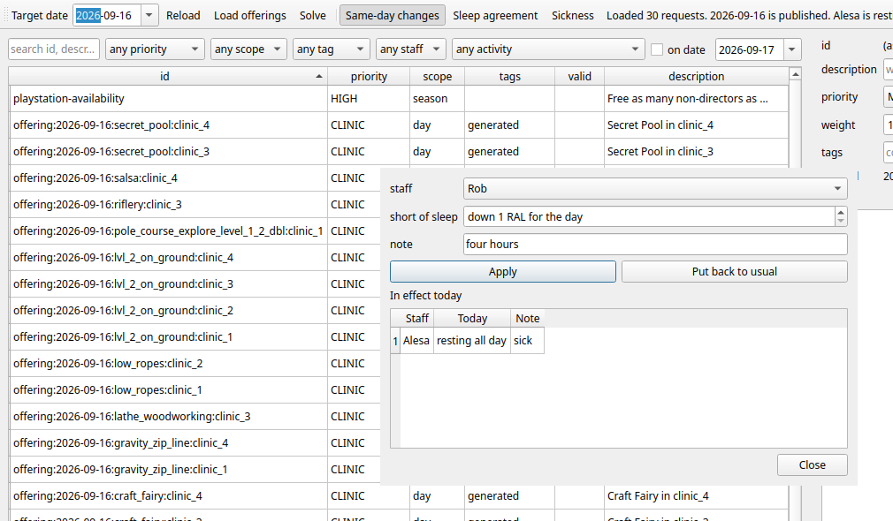

# Same-day changes

Tomorrow's schedule is published. In the morning someone tells you they slept badly, or
that they are ill and need the day off. Same-day mode re-solves the day around that,
moving as few people as it can, and tells you exactly who has to be told something new.

## The two things that change

Both go on the **Adjustments** tab of the config spreadsheet, one row per person per date.
They are facts about a person for one day, not requests, so they leave the Skills sheet
alone and expire on their own.

| Column | Meaning |
|---|---|
| `date` | The day it applies to. |
| `staff` | Who, as named on the Skills sheet. |
| `resting` | `all day`, `morning` or `afternoon`. Blank leaves them working the whole day. |
| `RAL_penalty` | How many levels to take off their usual RAL for the day. Blank takes off none. |
| `note` | Why, for the record: `sick`, `short sleep`. |

A row must give a `resting` or a `RAL_penalty`, otherwise it does nothing and the loader
says so. One row can do both, for someone who is short of sleep and resting the afternoon.

**Resting takes them off that part of the day.** No clinics, and no breaks either, since a
category such as `staff.all` stops offering anyone who is resting all day. That is why a
rest belongs here rather than in a `TASK FREE` request, which would collide with the
mandatory break rule and report a conflict every time somebody was ill.

A block belongs to the half of the day it **starts** in, split at `midday` under `[day]` in
`config.toml`, which is noon unless you change it. So a 12:00 lunch block counts as
afternoon.

**A RAL penalty narrows what they may run.** Camp's sleep agreement costs one level, so a
penalty of `1` takes a RAL 5 down to 4 for the day. They stay on the day and keep
everything their new level allows, and come off whatever it does not. A penalty large
enough to reach 0 rules out every clinic, since every position asks for at least RAL 1.

For an absence that is neither half a day nor all of it, write an ordinary request
instead, which can name the blocks:

```skedge
ON date.target
DURING {block.clinic_3 + block.clinic_4}
ACROSS staff.dylan
TASK FREE
```

## Re-solving



In the app, **Same-day changes** in the toolbar becomes available once the day on screen is
published. Switching it on reveals two buttons:

- **Sleep agreement**: pick the person, and their RAL drops by one for the day.
- **Sickness**: pick the person and whether they are resting all day, the morning or the
  afternoon.

Both write the same Adjustments row and both list what is already in effect, so one person
can be short of sleep and resting the afternoon without either recording wiping the other.
**Put back to usual** clears someone's row. Then press **Solve**. The schedule window opens with a **Changes** tab listing what moved. **Publish**
writes the day again, along with a Changes tab in Published Schedules.

From the command line:

```
puppet-strings solve --same-day
puppet-strings solve --same-day --publish
```

`--same-day` works on today by default rather than tomorrow, and refuses a day that has
never been published, since there would be nothing to hold on to. Publishing over the day
needs no `--force`, because replacing it is the point.

## What the solver holds on to

Same-day mode adds one tier between staffing the clinics and everything else:

1. `MUST_HAPPEN` requests, as always.
2. `CLINIC`: staff as many offered clinics as possible.
3. **Stability**: keep as many published assignments as possible.
4. `HIGH`, `MEDIUM`, `LOW`: the usual preferences.

So the day never loses a clinic in order to stay still, and it never moves anyone to chase
a preference. Anyone the change does not touch keeps their morning exactly as printed.

On the sample data, taking one lifeguard off the day and lowering another person's RAL
gives this:

| | Clinics staffed | Published rows kept |
|---|---|---|
| Plain re-solve | 19 of 24 | 41 of 76 |
| Same-day re-solve | 19 of 24 | 68 of 76 |

Both staff the same number of clinics. The plain re-solve happens to rearrange 35 people
who had no reason to move.

## The change log

The **Changes** tab has one row per staff member and block that is not what was published:

| Staff | Block | Was | Now |
|---|---|---|---|
| Alesa | Clinic 1 | Canoe 1 & 2 (1st) | free |
| Alesa | Clinic 2 | break 10:45-11:15 | free |
| Vic | Clinic 3 | Secret Pool (1st) | free |

A half-day rest, or a mandatory request the rest makes impossible, is worth knowing about:
if a counselor rests all morning and a `MUST_HAPPEN` request gives every counselor a
morning counselor hour, the two cannot both hold. The solve stops and the report names
that request, which is the signal to relax it or to rest them all day instead.

Anyone missing from it is unaffected. Times appear for a task that takes only part of its
block, so a break that moved shows where it moved to.
